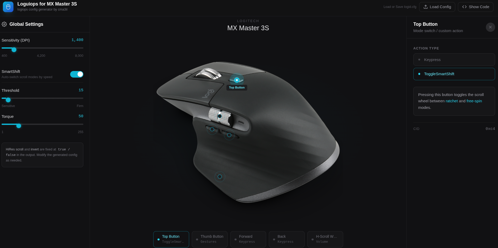

# loguiops

A user-friendly, modern web interface for generating and editing `logiops` configuration files for the Logitech MX Master 3S on Linux.

`loguiops` helps you visually configure mouse buttons, gestures, thumb wheel behavior, DPI, and SmartShift settings, then export the resulting config file for your system.

### Try it out!
A deployed version of the app is available on Vercel.  
Try it here: https://loguiops.vercel.app/

## Features

- Interactive MX Master 3S visual layout with clickable button zones
- Generate `logiops` config output for Linux setups (commonly `/etc/logid.cfg`)
- Load existing config files into the UI for editing
- Edit per-button actions:
  - Keypress combinations
  - Toggle SmartShift
  - Gesture actions (Up, Down, Left, Right, and press action)
- Configure thumb wheel behavior:
  - Horizontal scroll mode
  - Volume control mode
  - Invert direction and speed multiplier
- Configure global settings:
  - DPI
  - SmartShift enable/disable
  - SmartShift threshold and torque
- Copy generated config to clipboard
- Download generated config as a file

## Usage

### Run locally

If you prefer to run it locally, this project is currently a single-page app in `index.html`.

1. Clone the repository
2. Open `index.html` in your browser

Or, you can also serve it with a simple static server if preferred.

### Generate a config

1. Open the app
2. Adjust global settings and button mappings
3. Click **Show Code**
4. Copy or download the generated config
5. Place it in your desired path (for example `/etc/logid.cfg`)

### Load and edit an existing config

1. Click **Load Config**
2. Select an existing `.cfg` file
3. The UI parses the file and populates controls
4. Make changes and export updated output
   

## Acknowledgements

- Backend project: [PixlOne/logiops](https://github.com/PixlOne/logiops)
- Thanks to the logiops maintainers and contributors for building and maintaining the Linux daemon this UI targets.

## Trademarks

Logitech, Logi, and their logos are trademarks or registered trademarks of Logitech Europe S.A. and/or its affiliates. This project is an independent community tool and is not affiliated with, endorsed by, or sponsored by Logitech.

## License

This project is licensed under the MIT License.
